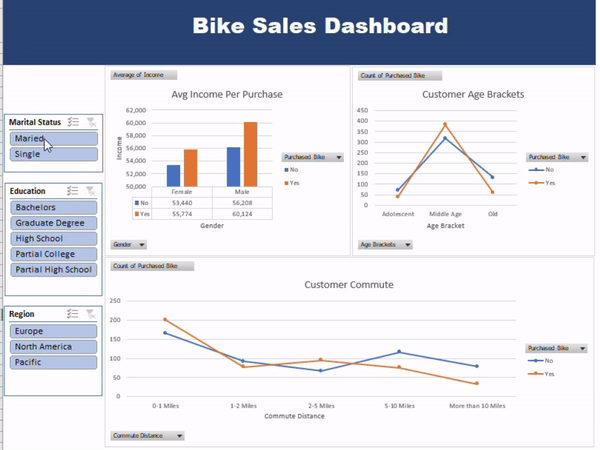

# Excel Dashboards

## Bike Sales Dashboard

### Description:

🚲 Bike Sales Dashboard Analysis:

The Bike Sales Dashboard provides an interactive and visual overview of key metrics related to bike purchases. It allows users to explore patterns and relationships within the data, segmented by demographic and regional factors. Below is a breakdown of the insights from the dashboard.

1. Income Analysis by Gender and Purchase Decision
Chart: "Avg Income Per Purchase"
Insights:
On average, male customers have higher income than female customers, regardless of whether they purchased a bike.
Customers who purchased bikes (both male and female) tend to have higher incomes, suggesting that income level may play a role in the decision to purchase a bike.
Male customers who purchased a bike have the highest average income among all groups.
2. Customer Age Brackets and Purchase Decision
Chart: "Customer Age Brackets"
Insights:
The age bracket with the highest likelihood of purchasing bikes is the Middle Age group, where both the "Yes" and "No" counts are highest.
Adolescents and older customers have significantly lower purchase rates, indicating that the middle-aged demographic is the most engaged customer base for bike purchases.
This chart suggests that age is a strong factor in bike purchasing decisions, with middle-aged customers being the primary buyers.
3. Commute Distance and Purchase Decision
Chart: "Customer Commute"
Insights:
There is a notable trend that customers with a commute distance of 1-2 miles are less likely to purchase a bike, while those commuting 5-10 miles have a higher likelihood.
Customers with more than 10 miles of commute distance are less likely to purchase a bike, which might be due to the impracticality of biking over long distances.
This suggests that commute distance influences the decision to buy a bike, with moderate distances (5-10 miles) being the sweet spot for potential bike purchasers.
4. Filters for Interactive Analysis
The dashboard includes filters for Marital Status, Education, and Region, allowing users to refine the analysis based on specific customer demographics.
Marital Status: Users can filter by single or married customers to observe any differences in purchasing behavior.
Education Level: This filter provides insights into whether education level correlates with bike purchases.
Region: Analyzing by region (Europe, North America, Pacific) helps understand geographic differences in bike purchasing trends. 🛠️📊

<image src="/resources/Dashboard.png" />
